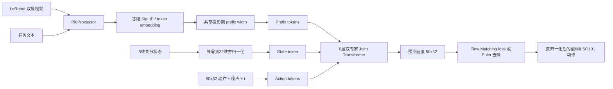

# Tiny π0：PyTorch 端到端实现与实训指南

本文只讲当前 `Tiny_pi0` 仓库中已经实现、测试和实际运行过的代码。目标是沿着一条连续链路理解：原始机器人数据如何进入模型，模型如何学习 50 步动作块，checkpoint 如何恢复，以及动作如何送到 SO101。

## 1. 项目边界

当前实现保留了 π0 最有教学价值的结构：

- 图像与语言组成 prefix；
- state、带噪动作与时间组成 suffix；
- prefix expert 和 action expert 使用独立参数；
- 两个 expert 的 Q/K/V 在注意力维度联合计算；
- 训练目标是条件 Flow Matching；
- 推理从高斯噪声通过 Euler 积分得到动作块；
- 推理时缓存每层 prefix 的 K/V。

需要明确三点：

1. 这是 PyTorch 教学实现，不是 `openpi` 仓库的镜像。
2. 当前 decoder 形状比官方 π0 小，并从头训练，不能加载官方 π0 decoder 权重。
3. PaliGemma 2 只提供冻结的视觉编码器、multimodal projector 和文本 embedding；Gemma 语言 decoder 没有被加载。

因此，“复刻”指架构思想、数据流、训练和推理机制对齐，而不是官方 checkpoint 的逐参数等形复现。

## 2. 当前端到端数据流



模型外部的统一 tensor 契约是：

| 内容 | 形状 | 说明 |
|---|---|---|
| 单路图像 | `[B, 3, 224, 224]` | SigLIP 输入 |
| `image_mask` | `[B]` | batch 中每个样本是否有该相机 |
| 文本 token | `[B, 48]` | BOS + prompt + newline + padding |
| state | `[B, 32]` | SO101 前 6 维有效，其余补零 |
| actions | `[B, 50, 32]` | 未来动作块 |
| timestep | `[B]` | 每个样本一个 flow 时间 |
| velocity | `[B, 50, 32]` | 模型预测结果 |

## 3. 环境准备

### 3.1 本机条件

- Ubuntu 22.04 或 WSL2 Ubuntu；
- Python 3.11；
- 本地 RTX 3050 Ti 4 GB 用于测试与 BF16 推理；
- RTX 4090 用于 `SO101_TINY` 训练；
- WSL 内 `nvidia-smi` 必须可见 GPU。

初始化项目：

```bash
cd ~/pi0/Tiny_pi0
uv sync
uv run pytest -q
```

`pyproject.toml` 声明 Python 版本、运行依赖和开发依赖；`uv.lock` 固定解析后的具体依赖版本。`uv sync` 根据这两个文件创建或更新 `.venv`，`uv run ...` 则在这个环境中运行命令。

### 3.2 PaliGemma 访问

先在 Hugging Face 页面接受 `google/paligemma2-3b-pt-224` 的许可：

```bash
uv run hf auth login
scripts/hf_download_server.sh google/paligemma2-3b-pt-224
```

登录成功但得到 403，通常表示账号尚未在模型页面接受 gated license，而不是 token 无效。

`pi0/paligemma_prefix.py` 从 `model-00001-of-00002.safetensors` 中选择性读取三个前缀：

```text
vision_tower.*
multi_modal_projector.*
language_model.model.embed_tokens.*
```

它没有构造完整 3B 模型，因此能在 4 GB 显存中运行。当前实测冻结参数约 10.08 亿，显存分配约 1.9 GB。

## 4. 配置：只保留 Tiny 架构

项目保留两档容量，但只有一套实现：

### `TINY_PI0`

位于 `configs/tiny.py`，用于单元测试和快速阅读代码：

```text
prefix expert: width=128, depth=2, mlp=256
action expert: width=64, depth=2, mlp=128
heads=4, kv_heads=1, head_dim=32
```

### `SO101_TINY`

位于 `configs/so101.py`，与当前 step7000 artifact 的架构一致：

```text
prefix expert: width=1024, depth=8, mlp=8192
action expert: width=512, depth=8, mlp=2048
heads=8, kv_heads=1, head_dim=128
action_dim=32, horizon=50, max_token_len=48
```

可训练部分约 2.58 亿参数。`TINY_PI0` 不是另一种算法，只是让完整测试无需构造 2.58 亿参数。

运行以下命令可核对配置：

```bash
uv run python -m scripts.inspect_config
```

## 5. Prefix：图像和语言如何进入模型

### 5.1 图像不是只做一次 patch embedding

`PaliGemmaPrefixEncoder.encode_images()` 会完整运行冻结的 SigLIP vision tower：

```text
[B, 3, 224, 224]
  -> 16 × 16 个 patch
  -> 256 个视觉 token
  -> SigLIP 27 层编码
  -> multimodal projector
  -> [B, 256, 2304]
```

一个 patch 对应一个 token，所以 `num_tokens=(224/14)^2=256`。`256` 是序列长度，`2304` 是每个 token 的特征宽度。

### 5.2 文本不是运行语言模型

`Pi0Processor` 把 prompt 变成 48 个 token id；`embed_text()` 只查 Gemma embedding table，并按 Gemma 输入约定乘 `sqrt(2304)`：

```text
[B, 48] token ids -> [B, 48, 2304]
```

图像特征不会再乘这个缩放，因此文本不存在“乘两次”的问题。图像和文本随后共享一个可训练线性层，从 2304 投影到 `SO101_TINY` 的 1024。

### 5.3 为什么接口有三路图像而数据只有两路

`IMAGE_KEYS` 保留三个通用位置：base、left wrist、right wrist。SO101 adapter 只填前两路，第三路的 `image_mask=False`。当整个 batch 都缺少某路相机时，`Pi0PrefixEmbedding` 会跳过 SigLIP 计算，也不会把这路 token 放进 transformer。

`image_mask` 的形状是 `[B]`，因为它描述每个样本是否存在整张相机图像；进入 prefix 后才扩展为 `[B, 256]`，表示该图像产生的全部视觉 token 是否有效。

## 6. Suffix：state、动作与时间

`Pi0ActionEmbedding` 构造 `1 + 50` 个 suffix token：

1. `state_proj([B,32]) -> [B,1,512]`；
2. `action_in_proj([B,50,32]) -> [B,50,512]`；
3. 一个样本共享同一个 `t`，生成 sinusoidal time embedding；
4. 每个动作 token 与 time embedding 拼接，经两层 MLP；
5. state token 与 50 个 action token 合并为 `[B,51,512]`。

同一条 action chunk 的 50 个动作使用同一个 `t`，不是 50 个互不相同的时间。训练时每个 batch 样本随机采一个 `t`，所以 batch 内不同样本的时间通常不同。推理的一轮 Euler step 中，整个 chunk 也共享当前时间。

最后 `project_velocity()` 把 50 个 action hidden states 从 512 投影到 32 维速度。`suffix_output[:, -50:, :]` 是沿序列维 `dim=1` 取最后 50 个 token，不是沿 hidden 维切片。

## 7. 双专家 Joint Transformer

每层由两个参数独立的 Gemma decoder layer 组成：

- prefix expert 处理视觉/语言 token，width 1024；
- action expert 处理 state/action/time token，width 512；
- 两边拥有独立 RMSNorm、Q/K/V/O projection 和 gated MLP；
- 两边的 head 数与 head_dim 相同，所以 Q/K/V 可以沿序列维拼接并进行联合注意力。

注意力内部形状可概括为：

```text
Q: [B, num_heads, sequence_length, head_dim]
K/V: [B, num_kv_heads, sequence_length, head_dim]
```

`width` 不等于序列长度。`width = num_heads × head_dim` 表示把每个 token 的一行特征拆成多个头；每个 head 仍处理所有 token，而不是只处理一行。

当前 `num_kv_heads=1`，属于 GQA/MQA。K/V 在计算中扩展给 8 个 query head 使用，但底层仍只有一组 K/V 参数。反向传播时，各 query head 对共享 K/V 的梯度会自动相加到同一个参数，不会产生八份互相冲突的 K/V 权重。

Q 乘 `head_dim**-0.5` 是为了让 QK 点积的方差不随维度增大，避免 softmax 过早饱和。

### Block attention

`make_att_2d_masks()` 先用 `att_masks` 的累计和划分 block，再允许 query 查看自身 block 和以前的 block：

- 图像和文本 prefix 属于同一个双向 block；
- state 开启新的 block；
- action token 再开启一个 block，并在 action block 内双向可见；
- padding token 永远不可见。

这样 action 能读取视觉、语言和 state，prefix 不依赖正在去噪的 action。

## 8. Flow Matching 训练目标

真实归一化动作记为 `a`，高斯噪声记为 `ε`。每个样本从 Beta(1.5, 1) 采样一个 `t`，并限制到 `[0.001, 0.999]`：

```text
x_t = t ε + (1 - t) a
u_t = ε - a
loss = MSE(v_theta(prefix, state, x_t, t), u_t)
```

当 `t≈0` 时输入接近真实动作；当 `t≈1` 时输入接近纯噪声。模型学习在条件 prefix 下预测整条路径的速度。

loss 的屏蔽分两层：

- `action_dim_mask`：SO101 只有前 6 维真实动作，第 7–32 维不参与 loss；
- `action_valid_mask`：episode 尾部凑不满 50 步时，重复最后动作用于保持 shape，但补齐步不参与 loss。

## 9. 推理与 Prefix KV cache

推理从 `[B,50,32]` 高斯噪声开始，在 `t=1` 到 `t=0` 做 Euler 积分：

```text
dt = -1 / num_steps
x <- x + dt * v_theta(x, t)
```

默认 `num_steps=10`，因此 decoder 会执行 10 次。

视觉、语言和 prompt 在这 10 次中不变。`prefill_prefix()` 先把 prefix 逐层向前计算，并保存每层经过 RoPE 的 K 与 V。随后 `decode_suffix()` 每一步只重新计算会变化的 action expert Q/K/V，再把 suffix K/V 与对应层的 prefix K/V 拼接。

为什么不缓存 prefix Q：Q 只用于“当前 token 去读取 K/V”。suffix 查询 prefix 时需要的是 prefix K/V；prefix Q 的注意力输出已在 prefill 中进入下一层 hidden state，之后不会再被 suffix 使用。缓存 Q 只会占显存，不会减少后续必要计算。

两层 decoder 时也不是只有一份 cache，而是每层一份 `(prefix_key, prefix_value)`，因为第 2 层的 prefix hidden state 已经过第 1 层更新。

## 10. LeRobot 数据适配

`LeRobotPi0Dataset` 读取：

```text
meta/info.json
meta/stats.json
meta/tasks.parquet
meta/episodes/chunk-*/*.parquet
data/chunk-*/*.parquet
videos/.../*.mp4
```

SO101 映射是：

```text
observation.images.front -> base_0_rgb
observation.images.wrist -> left_wrist_0_rgb
```

数据集的标称 FPS 决定相邻动作的时间间隔。当前元数据是 20 FPS，因此 horizon 50 表示大约 2.5 秒动作。相机硬件可用 30/60 FPS 采集，但这与动作控制频率不是同一件事；训练依据的是数据集帧和时间戳。

检查真实样本：

```bash
uv run python -m scripts.inspect_so101_dataset
```

重点确认 episode 数、帧数、FPS、任务文本、6 维 state/action、两张图像和有效 action 步数。

## 11. 归一化

默认读取 LeRobot `meta/stats.json` 中每个真实机器人维度的 `q01/q99`，映射到 `[-1,1]`：

```text
normalized = 2 * (x - q01) / (q99 - q01 + eps) - 1
```

推理输出再做逆变换。统计量只有 6 维，而模型 tensor 有 32 维，因此 normalizer 只变换前 6 维；补零维原样保留，并由 dimension mask 排除。这不是把数据“扩充到 `[B,50,D]`”，广播只是让同一组逐维统计量作用到任意 batch 和时间位置。

## 12. 训练流程

### 12.1 先做 100 步验收

```bash
uv run python -m scripts.train_so101 \
  --profile so101 \
  --max-steps 100 \
  --micro-batch-size 4 \
  --gradient-accumulation-steps 8 \
  --validation-interval 20 \
  --validation-batches 8 \
  --checkpoint-interval 50 \
  --output-dir checkpoints/so101_tiny_smoke
```

### 12.2 正式训练

```bash
uv run python -m scripts.train_so101 \
  --profile so101 \
  --max-steps 30000 \
  --micro-batch-size 4 \
  --gradient-accumulation-steps 8 \
  --learning-rate 1e-4 \
  --end-learning-rate 1e-5 \
  --warmup-steps 1000 \
  --validation-interval 500 \
  --validation-batches 32 \
  --validation-action-batches 1 \
  --validation-sampling-steps 10 \
  --checkpoint-interval 1000 \
  --output-dir checkpoints/so101_tiny
```

训练器执行以下步骤：

1. 按 episode 而非 frame 切分 train/validation，防止同一 episode 泄漏；
2. 冻结 PaliGemma 前端，只优化 input projection 和双专家 core；
3. 可训练参数与 AdamW moments 保持 FP32；
4. CUDA 矩阵计算使用 BF16 autocast；
5. 梯度累积后裁剪 norm，再执行 optimizer step；
6. warmup 后做 cosine decay；
7. 验证 flow loss、整个有效动作块 MAE 和首动作 MAE；
8. 原子保存 checkpoint，避免中途写坏目录。

有效 batch size 为：

```text
micro_batch_size × gradient_accumulation_steps
```

这里为 `4 × 8 = 32`。

恢复训练：

```bash
uv run python -m scripts.train_so101 \
  --profile so101 \
  --output-dir checkpoints/so101_tiny \
  --max-steps 30000 \
  --resume
```

恢复时应继续使用原训练参数。代码会恢复模型、optimizer、normalizer 和 flow generator 状态，并拒绝旧 BF16-master 权重混入 FP32-master 训练。

## 13. Checkpoint 与 artifact

训练 checkpoint 包含：

```text
step-00007000/
├── model.safetensors
├── optimizer.pt
├── normalizer.safetensors
├── flow_generator_state.pt
└── metadata.json
```

`model.safetensors` 只保存 `requires_grad=True` 的部分，冻结 PaliGemma 每次从本地 HF snapshot 重新加载。部署最少需要：

```text
model.safetensors
normalizer.safetensors
metadata.json
```

当前可用 artifact 为 `artifacts/pi0_so101_recommended_step7000`。目录名中的 `recommended` 是历史训练命名；其 `metadata.json` 中的架构就是现在的 `SO101_TINY`。部署恢复以 artifact 元数据为准，不依赖 Python 常量名。

## 14. 离线评估

```bash
uv run python -m scripts.infer_deploy_artifact \
  --artifact-dir artifacts/pi0_so101_recommended_step7000 \
  --sample-index 0 \
  --num-steps 10 \
  --output-json artifacts/pi0_so101_recommended_step7000/offline-actions.json
```

检查：

- 输出是否为 `[1,50,32]` 且全为有限值；
- 首动作相对当前 state 的每关节变化；
- 与录制动作的 MAE；
- 预测落在训练 q01–q99 内的比例；
- 推理耗时和峰值显存。

离线 loss 或某个样本通过，不等于真机任务成功。模型可能在闭环中进入未见过的状态，然后重复相似动作。

## 15. 真机部署架构

策略进程使用项目的 `uv` 环境，机器人进程使用 `lerobot` Conda 环境：

```text
SO101 + cameras
    -> LeRobot client
    -> JPEG/state/prompt HTTP request
    -> Tiny π0 GPU server
    -> 50×6 action response
    -> safety gate / LeRobot clipping
    -> motor command
```

启动服务：

```bash
uv run python -m scripts.serve_so101_policy \
  --artifact-dir artifacts/pi0_so101_recommended_step7000

curl http://127.0.0.1:8000/health
```

在 LeRobot 环境做 dry-run：

```bash
python -m scripts.run_so101_real \
  --robot-port /dev/serial/by-id/usb-1a86_USB_Single_Serial_5B79017734-if00 \
  --robot-id my_follower \
  --front-camera /dev/v4l/by-id/usb-BC-231019-A_XWF-1080P-video-index0 \
  --wrist-camera /dev/v4l/by-id/usb-XHH-260202-H_Integrated_Camera-video-index0 \
  --front-camera-fps 30 \
  --wrist-camera-fps 60 \
  --control-fps 20 \
  --num-steps 10 \
  --actions-per-inference 1 \
  --max-cycles 10
```

`--num-steps` 是一次 Flow Matching 推理的 Euler 积分次数；它不是机器人执行动作的数量。`--actions-per-inference` 才表示一个 50 步预测块中实际发送多少步。

推荐先保持 `actions-per-inference=1`：每执行一步就重新观察和规划。设成 50 会开环执行约 2.5 秒，期间视觉变化无法影响已有动作。

确认 dry-run 后才使用 `--execute`。默认安全顺序是：协议形状和有限值检查 → 策略跳变/训练范围检查 → LeRobot 相对目标裁剪。`--lerobot-safety-only` 只关闭中间一层。

## 16. 为什么当前 demo 容易重复动作

当前真实测试已经说明工程闭环成立，但 step7000 的策略质量有限。重复动作可能来自多项因素叠加：

- 只有单任务、有限 episode，状态覆盖窄；
- decoder 从随机初始化开始训练，没有官方 π0 action expert 先验；
- 视觉前端冻结，训练只学习到有限的任务相关对齐；
- 相似观测加相似 state 容易生成相似 action chunk；
- 执行过多 chunk 步骤会降低反馈频率；
- flow loss 最优 checkpoint 不一定是真机成功率最优 checkpoint。

客户端默认 `seed-mode=increment`，避免每轮用完全相同的初始噪声；这能减少严格重复，但不能解决策略本身没有学会状态进展的问题。

## 17. 调试与测试顺序

每次修改建议按以下顺序：

```bash
uv run ruff format configs pi0 scripts tests
uv run ruff check configs pi0 scripts tests
uv run pytest -q
uv run python -m scripts.inspect_config
uv run python -m scripts.inspect_so101_dataset
```

`ruff format` 只重排代码格式；`ruff check` 检查未使用 import、导入顺序和常见代码问题；`pytest` 运行行为测试。它们读取 `pyproject.toml` 中的配置，但不会随意修改该文件。

## 18. 当前源码学习顺序

按依赖从底层到端到端阅读：

1. `configs/schema.py`、`configs/tiny.py`、`configs/so101.py`；
2. `pi0/types.py`、`pi0/processor.py`；
3. `pi0/rms_norm.py`、`pi0/rope.py`、`pi0/attention.py`、`pi0/mlp.py`；
4. `pi0/decoder_layer.py`、`pi0/joint_decoder_layer.py`、`pi0/joint_transformer.py`；
5. `pi0/paligemma_prefix.py`、`pi0/prefix_embedding.py`、`pi0/action_embedding.py`；
6. `pi0/flow_matching.py`、`pi0/core.py`、`pi0/policy.py`；
7. `pi0/lerobot_dataset.py`、`pi0/normalization.py`；
8. `pi0/training.py`、`scripts/train_so101.py`；
9. `pi0/deployment.py` 和三条推理/真机脚本。

每读完一个模块，先看同名 `tests/test_*.py`。测试给出的输入 shape、异常条件和等价公式，比只看注释更容易确认自己是否真正理解。

## 19. 完成标准与下一阶段

当前仓库已经完成：模型结构、数据 adapter、归一化、训练、验证、checkpoint、KV cache 推理、离线评估、策略服务、SO101 双摄客户端和安全控制。

它最适合回答“π0 风格 VLA 从数据到电机是怎样连接起来的”。若下一阶段目标从学习转为提高任务成功率，应做三件事：

1. 增加初始姿态、物体位置、光照和失败恢复数据；
2. 用多个 held-out episode 和真机 rollout 成功率选择 checkpoint；
3. 将同一数据集与 LeRobot 官方预训练 π0 微调流程做基线对照。

这样，Tiny π0 保留为透明、可解释的教学基线，官方预训练模型负责验证大规模先验对真实任务效果的提升。
